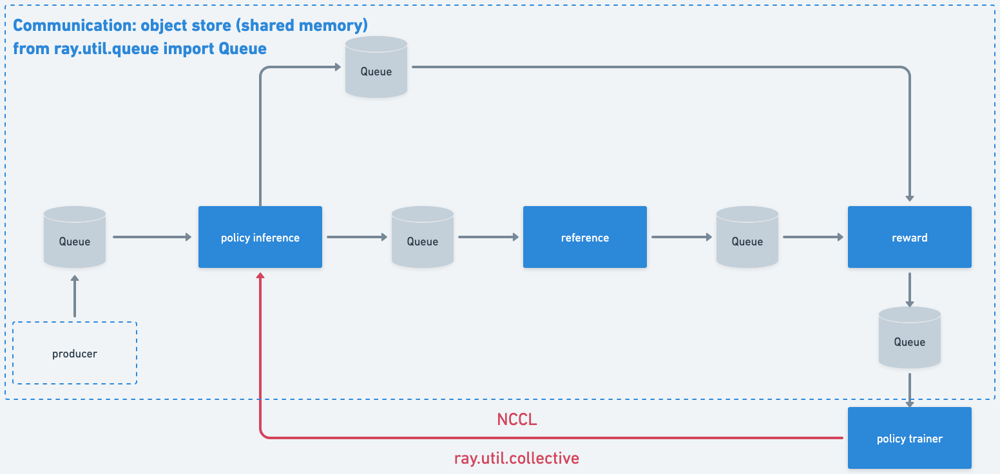
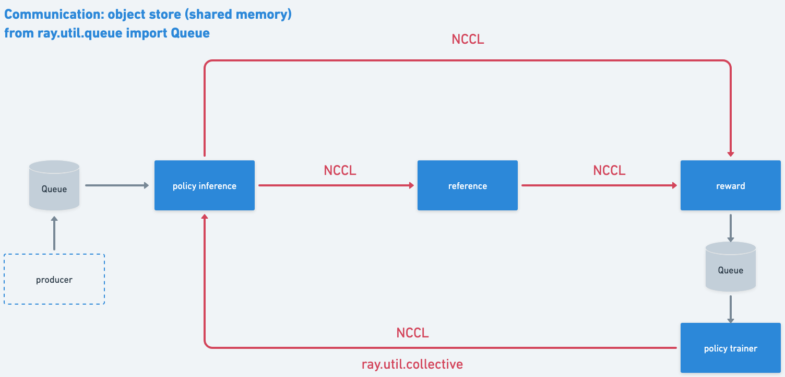
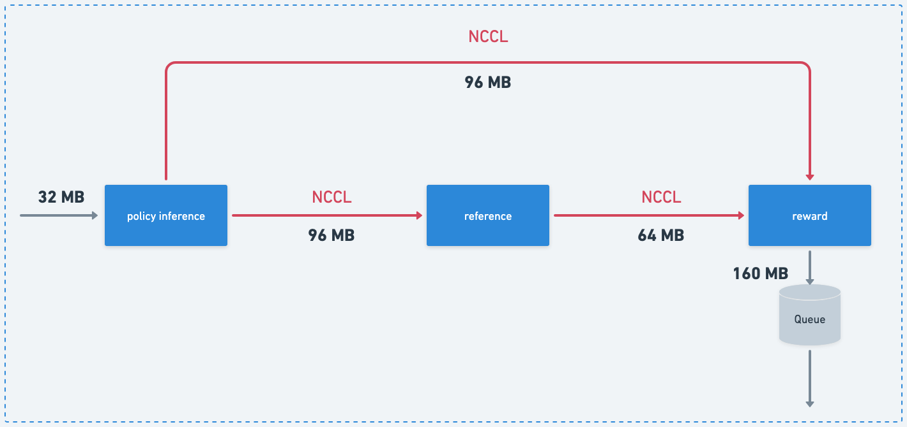
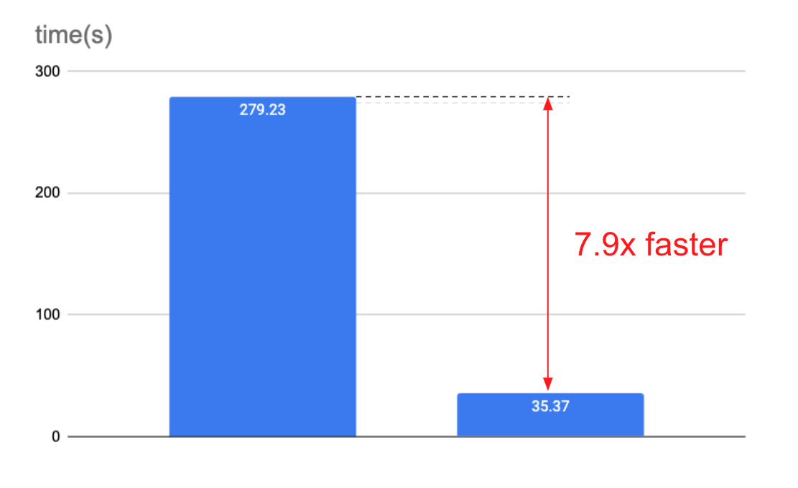

# Demo: Optimize ChatLearn with Ray Compiled Graph

This is a joint effort of @kevin85421, @hongpeng-guo, and @SumanthRH, and with inputs from @anmscale and @ruisearch42.

Ray Compiled Graph (RayCG for short) is a new feature in Ray to optimize communication overhead.
Its alpha release was in Ray 2.32.
See the [developer guide](https://docs.google.com/document/d/1xDs-yIBFLXuqUDLou-_KELERkzWrmGWri6p_xG18SH4/edit#heading=h.kzrrbhon06yz) for more details.

This repository simulates the data flow of [ChatLearn](https://github.com/alibaba/ChatLearn), a training framework for large-scale alignment.

* Disclaimer: We did our best to simulate the data flow. However, we are still working on verifying the actual data flow in ChatLearn.

# ChatLearn: Data flow of online DPO

In ChatLearn's implementation, the data flow of [online DPO](https://github.com/alibaba/ChatLearn/blob/main/examples/megatron/entry/train_online_dpo.py) consists of the following two parts:

* Use `ray.util.collective` with NCCL to synchronize parameters between the policy trainer and the policy inference.
* Other communication is done through `ray.util.queue` which uses object store to transfer data under the hood.



# Optimize the data transfer with Ray Compiled Graph

In this repository, we build a simple simulation to demonstrate how RayCG can optimize the data transfer in ChatLearn.
We replace the `ray.util.queue` between the policy inference model, reference model, and reward model with NCCL communication via RayCG.



# Benchmark results

In the benchmark, we assume `batch_size` is 1024, `prompt_seq_len` is 4096, and `int64` is used for the data type.
The scope of the benchmark doesn't cover the actual inference and training computation.
Instead, this demo focuses on the data transfer simulation between the policy inference model, reference model, and reward model as shown in the following figure:

* Note that the data size provided is not the "exact" size of the data transferred in online DPO. We calculate the data size based on `batch_size`, `prompt_seq_len`, and the `int64` data type. For implementation-related data size, we use the lower bound.



```python
# Run 100 iterations:
# policy inference -> reference model -> reward model -> retrieve reward

python3 simulate_chat_learn_data_flow.py # 279.23s
python3 ray_cg_simulate_chat_learn_data_flow.py # 35.37s
```




